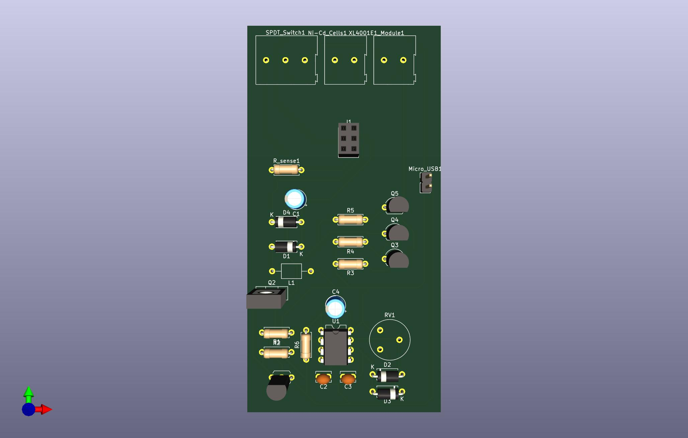
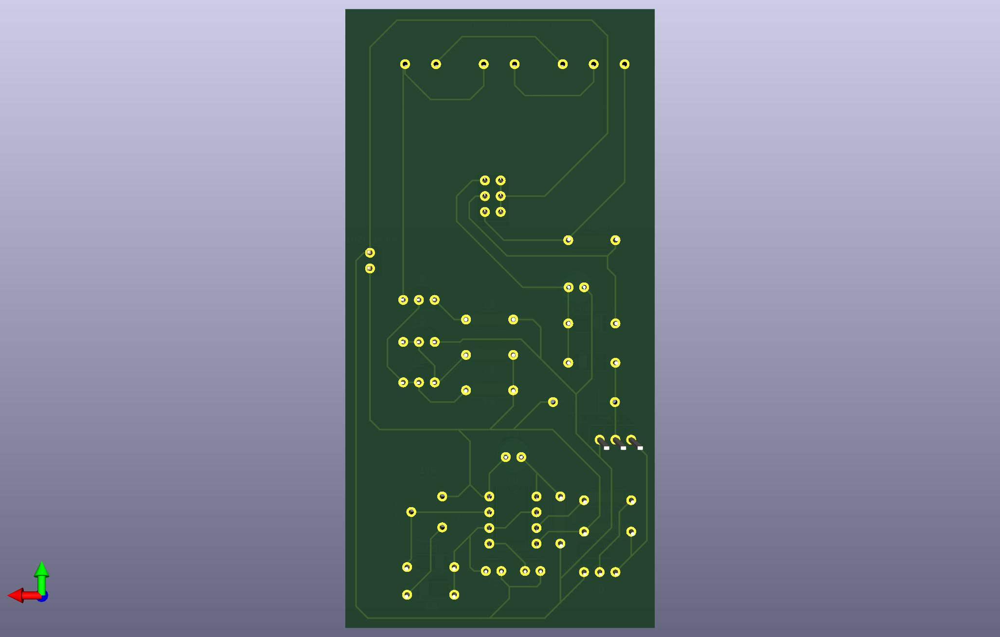

# 6 Ni-Cd Cells Charger

This circuit is designed to charge 5 Ni-Cd cells, in series, via a 5V USB source.

## Overview
The cells are trickle-charged at a constant current of 60mA (0.1C). The current is generated by a simple transistor constant current circuit. Care must be taken so that the voltage across the transistor is minimal so that power consumption is low and the transistor won't heat up too much. Charging will typically be completed after around 16 hours. However, because the charging current is low, it prevents the gas-venting effect in Ni-Cd batteries, allowing the cells to be left on the charger indefinitely.

Challenge: Since each cell has a nominal voltage of 1.2V, the total voltage of 5 cells in series is 6V, which is higher than the 5V USB source. As the cells are charged up, the voltage of each cell rises closer to 1.4V, thus increasing the total voltage further. In addition, other components of the charging circuit increases the total voltage by around 2V (voltage across current-set resistor, voltage across transistor, voltage across protection diode).

Solution: Boost the 5V USB to at 9V or more with a simple boost converter circuit. 'Simple' because this circuit does not have any feedback (at all!) to ensure the voltage stays constant if the load changes. I figured this would be fine because the current consumed by the load (the charging circuit) would be relatively constant. After some testing, I found this to be the case.

## Features
- There is a 1ohm resistor in series with the Ni-Cd battery pack, which allows the user to 'measure' the charging current by measuring the voltage across the resistor, where I(charging) = V(R-1ohm) / 1ohm

## Note
- The provided schematic includes the boost converter and constant-current charging circuit for the cells. It also provides screw-terminal connections for a XL4001E1 constant-currrent LED driver module. 

## Future Improvements
- Even though the circuit works fine at the moment, some type of feedback control should be added to the boost converter to make sure that the output voltage stays constant, for safety and efficiency concerns.